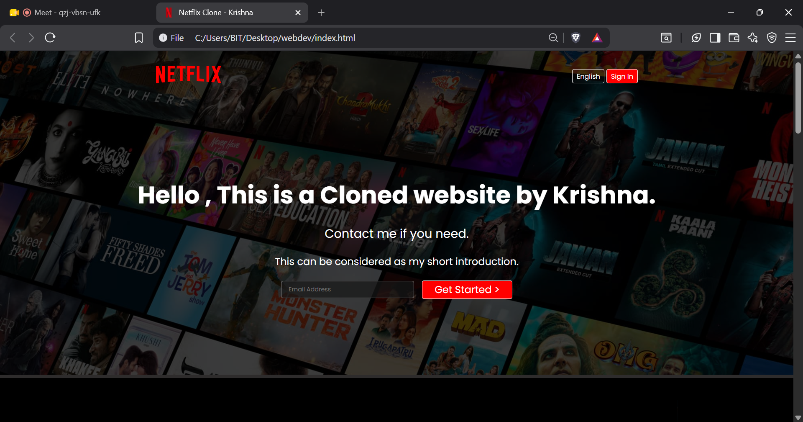
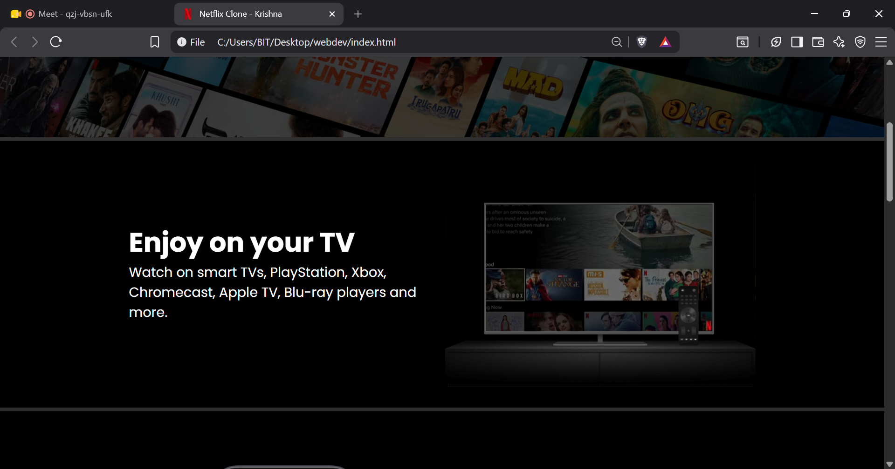
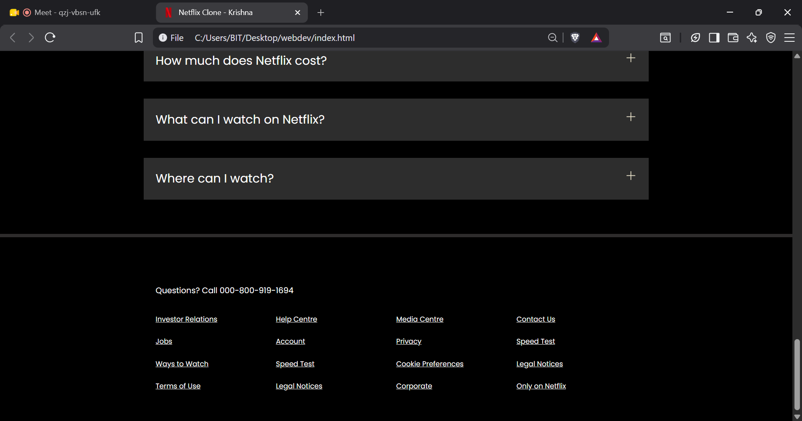

# Netflix Landing Page Clone

## Overview

This project is a front-end clone of the Netflix landing page developed using only HTML5 and CSS3. The objective was to recreate the layout and visual appearance of Netflix's homepage while strengthening core front-end development skills such as semantic HTML, responsive layouts, and modern CSS styling.

This project is intended for learning and portfolio purposes only.

---

## Features

- Responsive landing page layout
- Netflix-inspired user interface
- Hero section with background image and overlay
- Navigation bar with language selector and sign-in button
- Feature sections highlighting platform capabilities
- FAQ section
- Footer with organized navigation links
- Clean and structured codebase

---
## Preview
### Homepage

  

### Features Section

  

### Footer

  

---

## Technologies Used

- HTML5
- CSS3
- Flexbox
- CSS Grid
- Google Fonts

## Learning Outcomes

This project helped reinforce the following concepts:

- Semantic HTML structure
- CSS Flexbox and Grid
- Responsive web design
- Positioning and layering
- Typography and spacing
- Component-based page layout
- Recreating production-level user interfaces

---

## Future Improvements

- Add JavaScript for interactive components
- Implement a functional FAQ accordion
- Improve mobile responsiveness
- Add smooth transitions and animations
- Develop authentication pages
- Enhance accessibility

---

## Disclaimer

This project was developed solely for educational purposes. Netflix, its logo, and all related trademarks are the property of Netflix, Inc. This project does not intend to infringe on any copyrights or trademarks.

---

## Author

**Krishna Verma**

